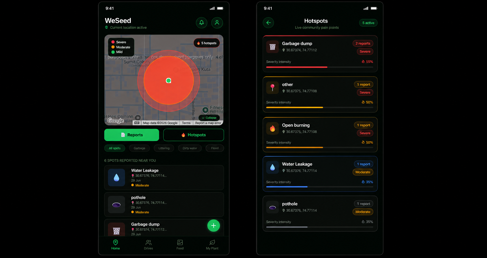
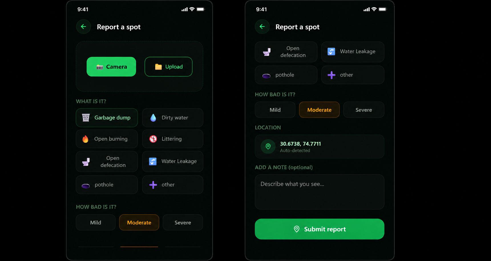
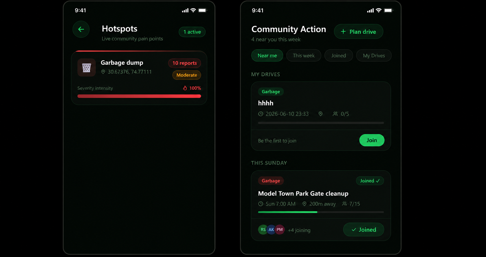
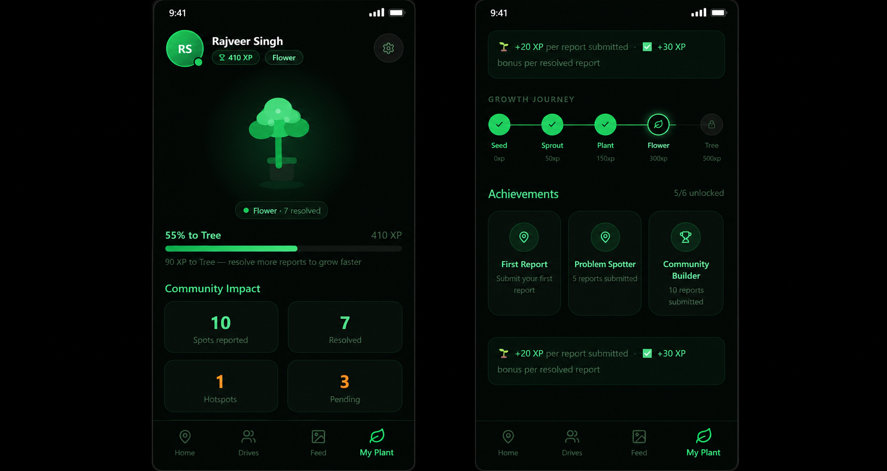

# 🌱 WeSeed — Take the First Step Together

> **The hardest part isn't solving a community problem. It's taking the first step together.**

WeSeed is an AI-powered hyperlocal civic reporting platform that empowers citizens to report, track, and collaboratively solve everyday community issues such as garbage dumps, potholes, water leakages, damaged streetlights, illegal dumping, broken trees, and more.

By combining AI-powered issue analysis, live mapping, hotspot detection, and community participation, WeSeed transforms individual reports into collective action.

## 🌐 Live Demo

**Firebase Hosting (Google Cloud):** https://weseed-4bc42.web.app

**Vercel Preview:** https://weseed.vercel.app

---

# 💭 Why I Built WeSeed

Right outside my college is a stretch of road that's almost always covered in garbage.

Every day I walked past it thinking,

*"Someone should fix this."*

Many times I wanted to.

But I never did.

Not because I didn't care.

Because I was afraid.

Afraid people would stare.

Afraid someone would laugh.

Afraid of that familiar thought:

**"Log kya kahenge?"**

Then I realized something.

Maybe thousands of people feel exactly the same.

People who genuinely care, but don't want to be the only one taking initiative in public.

That realization became **WeSeed**.

Not another complaint app.

Not another NGO.

A platform where people who already care can find each other, report local issues, organize action, and make change together.

Because the hardest part isn't fixing the problem.

It's taking the first step alone.

---

# 🌍 Problem Statement

Communities face everyday civic problems such as:

- Garbage accumulation
- Potholes
- Water leakages
- Broken streetlights
- Illegal dumping
- Fallen trees
- Public infrastructure issues

Although reporting systems exist, they are often fragmented, slow, and discourage community participation.

Citizens who genuinely want to contribute usually don't know:

- whether others have already reported the issue,
- who else wants to help,
- or whether any action is actually being taken.

WeSeed bridges this gap through AI, location intelligence, and community collaboration.

---

## 📱 Screenshots

### Home & Hotspots


---

### Report an Issue


---

### Community Action & Feed


---

### Plant Journey


# ✨ Features

## Smart Community Map

- Live Google Maps integration
- Nearby issue reports
- User location detection
- Interactive report markers

---

## AI-Powered Issue Reporting

Users can upload a photo of any civic issue.

Gemini AI automatically analyzes the image and predicts:

- Issue category
- Severity
- Risk assessment
- Responsible authority
- Suggested action
- Confidence score
- Environmental impact
- Health hazard
- Urgency level

Reports continue working even if AI analysis is unavailable.

---

## Hyperlocal Hotspot Detection

Nearby reports are automatically clustered to identify recurring civic problems.

The application:

- Groups nearby reports
- Detects high-density issue zones
- Calculates hotspot severity
- Displays color-coded hotspot regions

This enables citizens to instantly identify areas needing immediate attention.

---

## Community Reports

Browse reports submitted by nearby citizens.

Each report includes:

- Photo
- Issue category
- Severity
- Status
- AI analysis
- Timestamp
- GPS location

---

## Community Action

WeSeed transforms reports into real-world action through community-organized cleanup events.

Users can:

- Create community action drives
- Join nearby environmental drives
- View upcoming and joined events
- Track volunteer participation
- Organize cleanups around reported hotspots
- Coordinate environmental initiatives with local citizens

Instead of only reporting problems, WeSeed encourages communities to solve them together.
---

## Before & After Feed

Every successful cleanup deserves to be seen.

The community feed showcases environmental transformations through before-and-after updates, allowing volunteers to share the impact of their efforts.

Features include:

- Before vs After comparisons
- Community achievements
- Like and comment support
- Recent cleanup activities
- Public environmental success stories

Seeing visible change motivates more people to participate in future drives.

## Gamification-Plant Growth Journey


Every action contributes to your personal environmental journey.

Users earn experience points by reporting issues, participating in community actions, and resolving civic problems.

Progression:

| Stage | XP |
|--------|----|
| 🌱 Seed | 0 XP |
| 🌿 Sprout | 50 XP |
| 🪴 Plant | 150 XP |
| 🌸 Flower | 300 XP |
| 🌳 Tree | 500 XP |

The profile also includes:

- Community impact statistics
- Achievement badges
- Contribution history
- Environmental progress tracker

The more you contribute, the more your virtual plant grows alongside your real-world impact.

---

## Personal Dashboard

Every user has a personalized profile that tracks their environmental contributions.

Dashboard includes:

- XP progress
- Plant growth
- Reports submitted
- Issues resolved
- Active hotspots
- Pending reports
- Achievement badges
- Community impact statistics

# 🛠 Tech Stack

### Frontend

- React
- Vite
- JavaScript
- CSS

### Backend

- Firebase Firestore
- Firebase Hosting (Google Cloud)

### AI

- Google Gemini API

### Maps

- Google Maps JavaScript API
- @react-google-maps/api

### UI

- Lucide Icons
- Responsive Design
- Dark Theme

---

# 🚀 Getting Started

```bash
git clone https://github.com/yourusername/weseed.git

cd weseed

npm install

npm run dev
```

Production build:

```bash
npm run build
```

Deploy to Firebase Hosting:

```bash
firebase deploy
```

Firebase Hosting provides secure Google Cloud deployment for the application. :contentReference[oaicite:0]{index=0}

---

# 📂 Project Structure

```text
src/
│
├── assets/
│
├── components/
│   ├── BottomNav.jsx
│   ├── PlantSVG.jsx
│   └── StatusBar.jsx
│
├── screens/
│   ├── HomeScreen.jsx
│   ├── ReportScreen.jsx
│   ├── ReportsScreen.jsx
│   ├── HotspotsScreen.jsx
│   ├── DrivesScreen.jsx
│   ├── FeedScreen.jsx
│   └── PlantScreen.jsx
│
├── services/
│   └── geminiService.js
│
├── firebase.js
├── App.jsx
├── main.jsx
└── index.css
```

---

# 🚧 Roadmap

- ✅ Google Maps integration
- ✅ Firebase Firestore
- ✅ Firebase Hosting
- ✅ AI-powered issue analysis
- ✅ Community reports
- ✅ Hotspot detection
- ✅ Gamification
- ⬜ Firebase Authentication
- ⬜ Push Notifications
- ⬜ Municipal authority dashboard
- ⬜ Before/After cleanup verification
- ⬜ React Native application

---

# 🎯 Vision

Imagine opening one app and instantly knowing:

- what issues exist around you,
- where immediate action is needed,
- who nearby is willing to help,
- and how a community can solve problems together.

WeSeed aims to become the bridge between civic awareness and collective action.

---

# 👩‍💻 About

Built by **Nandini Mangla**

B.Tech Artificial Intelligence & Machine Learning Student

WeSeed was created from a simple belief:

**Communities become stronger when taking the first step is no longer something people have to do alone.**

---

# 📄 License

MIT License
